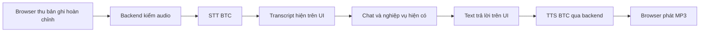

# Hướng dẫn agent triển khai voice bot bằng API BTC trong 2 tiếng

Ngày đối chiếu: **06/10/2026**. Đây là bản chỉ dẫn cuối để giao trực tiếp cho coding agent, tự đủ nội dung và không phụ thuộc tài liệu hướng dẫn khác. Các liên kết web chỉ là nguồn kiểm chứng. Đích bàn giao trong **120 phút**: **nhấn giữ để nói → thả để gửi → hiện transcript → bot trả lời bằng chữ → phát giọng nói**, có hủy, sửa transcript, dừng và nghe lại.

**Chốt phạm vi:** hoàn thành voice theo lượt trước; không đưa LiveKit, WebRTC, transcript trong lúc nói hoặc hội thoại hai chiều đồng thời vào đường triển khai bắt buộc. Tính năng tùy chọn chỉ được bắt đầu khi luồng chính đã chạy ổn và còn thời gian kiểm thử. Các mốc thời gian dưới đây là ngân sách triển khai, không phải cam kết độ trễ API.

Mọi inference phải qua **`https://api.thucchien.ai`**, dùng key BTC ở backend. Bộ cấu hình xuất phát: `gpt-4o-transcribe` → `gpt-6-luna` → `gpt-4o-mini-tts` với `nova`. Chọn này để bắt đầu tích hợp; chất lượng tiếng Việt và thời gian phản hồi phải đo trên gateway, không suy ra từ tên model.

## Nhiệm vụ và ràng buộc cho agent

Triển khai thật theo chỉ dẫn bên dưới, ưu tiên một lượt hoạt động từ microphone đến loa trước khi tối ưu. Không dừng ở scaffold, màn hình giả hoặc ba endpoint gọi riêng lẻ. Tự xử lý lựa chọn kỹ thuật trong phạm vi đã chốt; chỉ hỏi khi thiếu key, dữ liệu hoặc quyết định sản phẩm không thể suy ra từ code.

- Mở repo gốc `aitc2026-team-468-delta-mind` làm workspace để hook BTC hoạt động. Toàn bộ source/demo/tài liệu của vòng này đặt dưới `chung-khao/`; giữ cấu trúc BTC, thay đổi ngoài task và quy tắc đang áp dụng của repo.
- Hook AI Log có thể ghi prompt và output công cụ. Không sửa/bypass hook, không tự gửi lại log, không in secret hoặc dữ liệu riêng tư qua công cụ phát triển. Chỉ dùng audio/dữ liệu được phép dùng trong môi trường thi.
- Runtime đọc key từ môi trường server; agent không in `.env`, key, token vào output. Key ứng dụng, key coding và `AI_LOG_API_KEY` có mục đích khác nhau; không tự sao chép key giữa chúng hoặc cho rằng đổi tên biến sẽ tách budget.
- Tất cả inference, kể cả STT/TTS, LLM, đánh giá tự động hoặc model dự phòng, chỉ đi qua BTC. Không dùng browser SpeechRecognition, provider SDK mặc định, LiveKit Inference hoặc dịch vụ AI bên ngoài làm fallback.
- Transcript là dữ liệu người dùng, không cấp quyền truy cập hay thực thi. Quyền dữ liệu và xác nhận thao tác do backend kiểm. Không dùng LLM làm nguồn số dư, tính tiền hoặc xác nhận giao dịch; chỉ đọc kết quả từ dữ liệu/tools thật.
- Không tự thêm RAG, tools, LangGraph, database, hệ thống tài khoản hoặc triển khai cloud để hoàn thành voice. Nếu ứng dụng đã có các thành phần đó, tích hợp vào đúng luồng hiện có.
- Không tự commit/push. Bàn giao phạm vi thay đổi, cách chạy, kết quả kiểm tra và giới hạn thực tế.

Tài liệu này chưa kèm kết quả inference hay đo microphone thực tế. Thiếu key hoặc người thử giọng nói thì tiếp tục hoàn thành phần có thể làm và báo phần chưa kiểm chứng; không sinh transcript, audio mẫu hoặc số đo giả để tuyên bố đạt.

## Phạm vi bàn giao trong 120 phút

| Mức | Tính năng | Quyết định |
|---|---|---|
| Bắt buộc | Nhấn giữ, thả gửi, kéo hủy hoặc nút hủy; trạng thái và thời gian ghi | Làm |
| Bắt buộc | Transcript sau khi nói, sửa rồi gửi lại; chat text vẫn dùng được | Làm |
| Bắt buộc | Câu trả lời ngắn, TTS tiếng Việt, dừng và nghe lại | Làm |
| Bắt buộc | Hủy lượt cũ, lỗi microphone/API, fallback phát thủ công | Làm |
| Ưu tiên sau luồng chính | Chữ trả lời hiện dần từ LLM | Làm nếu streaming đã có hoặc hoàn thành đúng hạn |
| Tùy chọn | Rảnh tay theo lượt, tự gửi khi ngừng nói | Chỉ thử sau khi luồng chính vượt kiểm thử |
| Ngoài 2 tiếng | TTS từng câu khi LLM đang sinh | Không thêm hàng chờ/chia câu vào MVP |
| Ngoài 2 tiếng | Transcript liên tục khi đang nói, nghe và nói đồng thời, ngắt bằng giọng nói | Để sau |
| Ngoài 2 tiếng | LiveKit, WebRTC, SIP, voice cloning, nhiều người nói, diarization | Để sau |

Nâng cấp tùy chọn duy nhất là rảnh tay theo lượt. Nếu đến phút 90 vẫn còn lỗi luồng chính, dùng toàn bộ thời gian còn lại để sửa và kiểm thử. Không để một tính năng có nút bấm nhưng hành vi giả trong bản demo.

## Môi trường và cấu hình đã chốt

**Nếu có app:** giữ framework, auth, session, history, prompt nghiệp vụ và transport chat đang chạy. Thêm lớp thu âm/STT ở đầu và TTS/player ở cuối. Không thay model nghiệp vụ chỉ vì thêm voice.

**Nếu chưa có app:** tạo một app Next.js + React trong `chung-khao/voice-bot/`, route handlers dùng Node runtime. Dùng package manager/runtime sẵn có phù hợp framework; ghi lockfile. Dùng `fetch`, `FormData`, `MediaRecorder`, Web Audio và audio element; chưa cần SDK AI, state machine library hay UI kit mới. Chạy demo local trên Chrome desktop trước, giữ server ở loopback; thiết bị/browser khác chỉ được nhận là hỗ trợ sau khi thử. Không dựng auth/DB mới cho demo local và không tự công khai backend chứa key.

| Cấu hình server | Giá trị xuất phát |
|---|---|
| `BTC_API_KEY` | Key ứng dụng BTC do người vận hành cấp; không có giá trị mặc định |
| Host inference | Cố định `https://api.thucchien.ai` |
| STT model | `gpt-4o-transcribe` |
| Chat model cho app mới | `gpt-6-luna` |
| TTS model và voice | `gpt-4o-mini-tts`, `nova` |
| Đọc tự động | Người dùng có công tắc bật/tắt; hiện nhãn “Giọng đọc AI” |
| Rảnh tay | Tắt mặc định; ẩn nếu không triển khai xong |
| Lưu hội thoại cho app mới | Trong bộ nhớ giao diện; reload sẽ xóa |

Không đặt key vào `NEXT_PUBLIC_*`, localStorage, request từ browser hoặc source. Route Next.js có xử lý audio/FFmpeg phải chạy Node, không Edge. FFmpeg là phụ thuộc tùy chọn khi browser codec không được BTC nhận; kiểm binary trên chính môi trường demo, không chỉ máy phát triển.

App mới giữ tối đa 6 lượt hội thoại hoàn tất gần nhất trong context; server tự thêm system prompt, chỉ nhận role `user`/`assistant` với text và giới hạn độ dài. Không nhận `system`, tên tool, API host hoặc model tùy ý từ browser. Transcript hiện tại được thêm đúng một lần. Không thêm message lỗi, bản nháp hoặc assistant đang bị cắt vào context; không dùng local history làm bằng chứng cho dữ kiện nghiệp vụ.

Trước smoke test, kiểm quyền model bằng `GET /v1/models`. Nếu cần xác định quota, đọc `GET /key/info`, lấy `info.team_id` rồi `GET /team/info?team_id=<đã URL-encode>` trên cùng host BTC. Chỉ ghi model được cấp và số liệu budget/limit cần thiết; không dump response. Hạn mức `null` ở key không có nghĩa team vô hạn. [Kiểm tra quyền và chi tiêu BTC](https://docs.thucchien.ai/docs/round-2/api-reference/spend-checking).

## Khả năng API được xác nhận

| Nhu cầu | Hợp đồng BTC | Cách triển khai |
|---|---|---|
| STT | `POST /audio/transcriptions`; multipart gồm `model`, `file`; JSON có `text` | Upload bản thu đã hoàn tất |
| Chat | `POST /chat/completions`; hỗ trợ `stream=true` cho delta văn bản | Tái sử dụng chat hiện có |
| TTS | `POST /audio/speech`; JSON gồm `model`, `input`, `voice`; trả audio | Lấy bytes, phát MP3 |
| STT đầu vào liên tục | Chưa thấy hợp đồng Realtime/WebSocket/WebRTC trong tài liệu BTC đã rà | Không tự dựng URL hoặc dùng URL provider |

Nguồn: [STT BTC](https://docs.thucchien.ai/docs/round-2/api-reference/speech-to-text), [chat BTC](https://docs.thucchien.ai/docs/round-2/api-reference/text-generation), [TTS BTC](https://docs.thucchien.ai/docs/round-2/api-reference/text-to-speech).

**Ba loại streaming khác nhau:** chữ LLM hiện dần; transcript của một file đã thu hiện dần; nhận audio trực tiếp từ microphone. OpenAI phân biệt hai loại STT sau trong [tài liệu file transcription](https://developers.openai.com/api/docs/guides/speech-to-text). Việc provider hỗ trợ không chứng minh gateway BTC đã mở cùng giao thức.

Ví dụ TTS của BTC dùng `stream=True` hoặc `stream_to_file` để tải file. Không dùng ví dụ đó làm bằng chứng rằng gateway chuyển tiếng đầu tiên tới người nghe trước khi sinh xong. Bản tối thiểu nhận đầy đủ audio rồi phát. [Hướng dẫn TTS BTC](https://docs.thucchien.ai/docs/round-2/user-guide/text-to-speech).

Các tham số STT như `language`, `prompt`, `stream`; TTS như `instructions`, `speed`, `response_format`; cùng voice hoặc codec ngoài ví dụ BTC đều cần smoke test đúng model trước khi dùng. Không mất quá 5 phút thử một tham số tùy chọn.

## Chọn model và giọng đọc

| Vai trò | Mặc định đề xuất | Phương án đối chiếu |
|---|---|---|
| STT | `gpt-4o-transcribe` | `gpt-4o-mini-transcribe` nếu chất lượng bộ câu thử đạt yêu cầu |
| STT khác | Không thêm vào đường chính | `gpt-transcribe`, `gemini-3.5-transcribe-preview` khi model mặc định không dùng được hoặc cần thử tiếp |
| Hội thoại | `gpt-6-luna`, `reasoning_effort="none"` cho câu hỏi đơn giản | Giữ model/chatbot nghiệp vụ đang chạy nếu đã ổn |
| TTS | `gpt-4o-mini-tts`, `nova` | `gemini-2.5-flash-preview-tts`, `Zephyr` hoặc `Charon` |
| TTS khác | Chưa ưu tiên trong 2 tiếng | `gemini-2.5-pro-preview-tts`, `gemini-3.1-flash-tts-preview` sau khi nghe thử |

BTC liệt kê các model này. Với `gpt-transcribe`, gửi `response_format="json"`. GPT dùng `max_completion_tokens`; không gửi `max_tokens`. Cấu hình `none` trên đây chỉ dành cho `gpt-6-luna`, không áp đại trà sang model khác. [Model và tham số BTC](https://docs.thucchien.ai/docs/round-2/user-guide/openai-deepseek), [STT BTC](https://docs.thucchien.ai/docs/round-2/user-guide/speech-to-text).

Giọng OpenAI và Gemini thuộc hai tập khác nhau; không gửi `nova` cho Gemini hoặc `Zephyr` cho OpenAI. Tiếng Việt được OpenAI TTS hỗ trợ, nhưng hãng ghi các voice được tối ưu cho tiếng Anh; vì vậy phải nghe thử thay vì mặc định một voice là tốt nhất cho tiếng Việt. [OpenAI TTS](https://developers.openai.com/api/docs/guides/text-to-speech).

**Quy tắc chốt nhanh:** dùng mặc định nếu giọng dễ hiểu, không đọc sai dữ kiện quan trọng. Nếu chưa đạt, nghe cùng hai câu trên Gemini Flash TTS; chọn kết quả tốt hơn trong điều kiện đo. Không tự thay nhiều model giữa một cuộc trò chuyện và không gọi dự phòng tất cả model cùng lúc.

## Kiến trúc và hợp đồng ứng dụng



Dùng HTTP thông thường. Không cần WebSocket giữa browser và backend để tải một file. Không base64 audio trong JSON khi có multipart/binary response. Nếu thêm streaming text, dùng cơ chế đang có; tránh viết một tầng điều phối mới.

Ba route dưới đây là **route đề xuất của app đội**, không phải URL BTC. Điều chỉnh tên theo codebase, giữ cùng ý nghĩa:

| Route app | Request | Response và trách nhiệm |
|---|---|---|
| `POST /api/voice/transcribe` | Multipart `audio`, `turnId` | JSON `turnId`, `text`; kiểm file, gọi BTC STT |
| `POST /api/chat` | JSON `turnId`, `message`, context/session theo app; `replaceTurnId` khi sửa lượt | JSON `turnId`, `text`; hoặc luồng text đã có |
| `POST /api/voice/speech` | JSON `turnId`, `text` | Audio binary; model/voice do server chọn |

Frontend gọi theo thứ tự để transcript/text được hiển thị trước audio. TTS lỗi thì giữ nguyên câu trả lời và cho “Thử đọc lại”; không gọi lại LLM. Khi TTS đã thành công, nghe lại dùng Blob đã tải, không tạo inference mới.

Chỉ cho sửa lượt thoại người dùng mới nhất, chưa có lượt người dùng kế tiếp. `replaceTurnId` phải trỏ tới lượt đó trong cùng session; thay nội dung cũ và loại câu trả lời gắn với nó khỏi context. Cập nhật history theo ID lượt để retry không thêm message trùng; nếu backend lưu history, backend cũng phải kiểm lượt/revision còn hiệu lực trước khi ghi kết quả về muộn. Không tạo hệ thống sửa lịch sử nhiều nhánh trong MVP.

Backend không tin `turnId` là quyền truy cập. Giữ auth/quyền/session của app; khóa host AI cố định; model nằm trong allowlist server; không nhận base URL hoặc key từ browser. Không đặt key trong biến `NEXT_PUBLIC_*`, localStorage hoặc bundle.

Hạn mức app đề xuất cho demo, **không phải giới hạn BTC**: tối đa 30 giây ghi/lượt, 8 MiB/upload, 2.000 ký tự TTS, một lượt đang chạy mỗi giao diện. Điều chỉnh upload cap cho thấp hơn giới hạn framework/host, có chỗ cho multipart overhead; giới hạn body khi nhận dữ liệu, không chỉ sau khi đã đọc toàn bộ vào RAM. Không tin `durationMs` từ client là kiểm chứng độ dài file; nếu backend có media probe thì kiểm thời lượng thực. Không tự cắt file quá giới hạn rồi giả vờ đã nhận đủ câu.

Sau khi làm sạch văn bản để đọc, nếu vượt 2.000 ký tự: giữ toàn bộ câu trả lời chữ, bỏ tự đọc, hiện “Câu trả lời quá dài để đọc trong chế độ này”. Backend trả lỗi riêng `TTS_TEXT_TOO_LONG`; không đưa nút retry cùng payload, không cắt giữa số liệu và không gọi LLM phụ để tóm tắt. Giới hạn này khác với giới hạn token sinh câu trả lời.

Tách tối thiểu theo trách nhiệm có thật: điều khiển recorder, player, component chat và client BTC phía server. Nếu dự án chưa có quy ước, có thể dùng `use-voice-recorder.ts`, `voice-player.ts`, `voice-chat.tsx`, `btc-voice.ts`. Không tạo abstraction đa provider hoặc database audio cho demo.

## Payload BTC để agent đối chiếu

Các mẫu là hợp đồng request để tích hợp, chưa phải endpoint ứng dụng hoàn chỉnh. `Authorization: Bearer <key BTC từ môi trường server>` dùng cho cả ba request. Base URL raw HTTP là `https://api.thucchien.ai` như ví dụ BTC; không tự thêm `/v1` hoặc thay host.

### STT

```text
POST /audio/transcriptions
Content-Type: multipart/form-data; boundary=<do HTTP client tạo>

model = gpt-4o-transcribe
file = <bytes của file audio thật, filename và MIME đúng định dạng>
```

Không tự đặt header multipart thiếu boundary. Chỉ đọc `text` khi HTTP thành công và JSON/schema hợp lệ. Transcript rỗng thì dừng lượt, yêu cầu ghi lại hoặc nhập chữ; không gọi LLM để đoán người dùng vừa nói gì. Đổi sang `gpt-transcribe` thì bổ sung form field `response_format=json`.

### LLM

```json
{
  "model": "gpt-6-luna",
  "messages": [
    {
      "role": "system",
      "content": "Trả lời bằng tiếng Việt tự nhiên, thường 1 đến 3 câu ngắn, thông tin chính trước. Chỉ khẳng định dữ kiện có trong nguồn hoặc kết quả công cụ được cung cấp; thiếu thì hỏi lại. Không nói đã tra cứu, thay đổi dữ liệu hoặc hoàn tất thao tác khi chưa có kết quả xác nhận. Giữ nguyên số, tên và mã định danh; hỏi lại khi mơ hồ. Ưu tiên văn bản dễ đọc thành tiếng."
    },
    {
      "role": "user",
      "content": "<transcript đã chốt hoặc tin nhắn người dùng>"
    }
  ],
  "reasoning_effort": "none",
  "max_completion_tokens": 2048,
  "stream": false
}
```

Gửi JSON tới `POST /chat/completions`; chèn history hợp lệ trước user message hiện tại. Với app mới chỉ chat text, đọc `choices[0].message.content` và chỉ hoàn tất khi là chuỗi không rỗng, `finish_reason === "stop"`. Các trạng thái khác phải được xử lý rõ; không đọc câu trả lời bị cắt hoặc đoán nội dung bị thiếu. Mức 2.048 là giới hạn kỹ thuật đề xuất, không bảo đảm text dưới 2.000 ký tự.

Với app nghiệp vụ, chỉ bổ sung phong cách trả lời ngắn vào prompt hiện có; không thay policy quyền dữ liệu, nguồn dữ kiện, tool calling hoặc xác nhận. Giữ vòng tools và cấu hình suy luận đã kiểm chứng, không dùng điều kiện text-only ở trên để chặn một vòng tool hợp lệ.

Khi `stream=true`, dùng parser của SDK/framework đang có. Delta có thể thiếu content hoặc chia giữa UTF-8/SSE frame; không coi mỗi network chunk là một JSON hoàn chỉnh. Đánh dấu hoàn thành từ giao thức upstream, không chỉ từ việc kết nối đóng. Lỗi giữa luồng phải để câu trả lời ở trạng thái chưa hoàn tất. [Streaming chat BTC](https://docs.thucchien.ai/docs/round-2/api-reference/text-generation).

### TTS

```json
{
  "model": "gpt-4o-mini-tts",
  "input": "<câu trả lời đã hoàn tất và chuẩn bị cho giọng đọc>",
  "voice": "nova"
}
```

Gửi JSON tới `POST /audio/speech`. Kiểm HTTP status và Content-Type trước khi đọc binary; không phát JSON lỗi dưới dạng MP3. Trả audio từ backend với MIME đúng và `Cache-Control: no-store`. Mẫu đối chiếu Gemini chỉ đổi sang model và voice tương ứng, không trộn bộ tham số chưa kiểm chứng.

Chỉ thêm `instructions` nếu BTC đã chấp nhận và kết quả nghe cho thấy có tác dụng. Không nhét “Hãy đọc chậm...” vào `input` của TTS chỉ đọc văn bản, vì câu đó có thể bị đọc ra loa. Với cấu hình tối thiểu, điều khiển nhịp nói bằng câu ngắn và dấu câu.

### Helper HTTP chạy riêng ở server

Mẫu dưới đây tự đủ, dùng native fetch và không tự retry. Đặt trong module chỉ được import bởi server. Route vẫn phải kiểm payload, quyền, quota và response; helper không thay các kiểm tra đó.

```javascript
const BTC_ORIGIN = "https://api.thucchien.ai";
const BTC_POST_PATHS = new Set([
  "/audio/transcriptions",
  "/chat/completions",
  "/audio/speech",
]);

export async function btcPost(path, { json, form, signal }) {
  if (!BTC_POST_PATHS.has(path)) throw new Error("BTC_ROUTE_NOT_ALLOWED");
  if (!signal) throw new Error("BTC_ABORT_SIGNAL_REQUIRED");
  if ((json !== undefined) === (form !== undefined)) {
    throw new Error("PROVIDE_EXACTLY_ONE_BODY");
  }
  const key = process.env.BTC_API_KEY?.trim();
  if (!key) throw new Error("MISSING_BTC_API_KEY");
  const headers = { Authorization: `Bearer ${key}` };
  if (json !== undefined) headers["Content-Type"] = "application/json";

  return fetch(`${BTC_ORIGIN}${path}`, {
    method: "POST",
    headers,
    body: form !== undefined ? form : JSON.stringify(json),
    signal,
    redirect: "error",
    cache: "no-store",
  });
}
```

STT tạo `FormData`, append `model` và `file` đúng tên; file giữ MIME/extension thật. Gọi helper với `{ form, signal }`; chat/TTS dùng `{ json, signal }`. Xử lý `response.ok` trước khi parse, dùng `response.json()` cho STT/chat và binary cho TTS. Tách status/mã lỗi an toàn, không gửi nguyên body lỗi nội bộ hoặc Authorization về UI.

Mỗi request có `AbortController` và timer theo ngân sách còn lại. Liên kết abort từ client nếu runtime hỗ trợ, nhưng vẫn luôn có timeout server; giữ timer đến khi đọc xong response body, dọn timer/listener trong `finally`. Trên cancellation, dọn response reader hoặc body đang đọc. Không chuyển host khi redirect, timeout hoặc lỗi codec.

## Thu âm và codec phải kiểm ngay từ đầu

**Smoke test ưu tiên số một là audio thật do chính browser đích ghi ra.** Một file MP3 mẫu chạy được chưa chứng minh bản ghi WebM/MP4 từ giao diện chạy được.

1. Yêu cầu microphone trên HTTPS hoặc localhost. Xin quyền bằng thao tác rõ ràng của người dùng; nếu quyền bị từ chối thì giữ chat text và hướng dẫn cấp lại.
2. Dùng `MediaRecorder.isTypeSupported()` để chọn ứng viên như `audio/webm;codecs=opus`, `audio/mp4`, rồi định dạng mặc định browser. Khả năng thu của browser và khả năng nhận của BTC là hai kiểm tra khác nhau.
3. Ghi lại `recorder.mimeType` thực tế; chọn extension/MIME tương ứng. Không đổi đuôi WebM thành MP3/WAV.
4. Gom mọi `dataavailable` có dữ liệu; đợi sự kiện `stop`, khi chunk cuối đã tới, rồi tạo một Blob hoàn chỉnh. Chỉ upload khi lượt kết thúc bằng hành động Gửi hợp lệ, không có lỗi recorder.
5. Thử upload chính Blob đó qua backend đến BTC. Nếu không nhận codec, chuyển local bằng FFmpeg phía server sang MP3 rồi thử lại.

Nguồn browser: [getUserMedia](https://developer.mozilla.org/en-US/docs/Web/API/MediaDevices/getUserMedia), [isTypeSupported](https://developer.mozilla.org/en-US/docs/Web/API/MediaRecorder/isTypeSupported_static). BTC dùng MP3 trong [ví dụ STT](https://docs.thucchien.ai/docs/round-2/user-guide/speech-to-text), chưa liệt kê đầy đủ codec qua gateway.

FFmpeg chỉ xử lý audio local, không phải API AI bổ sung. Khi cần, chạy bằng process API với mảng arguments, không ghép tên file người dùng thành shell command. Ví dụ command tương đương cho file tạm do server tự tạo:

```bash
ffmpeg -nostdin -y -i /tmp/voice-input.webm -vn -ac 1 -ar 24000 -c:a libmp3lame -b:a 64k /tmp/voice-output.mp3
```

Trong code dùng đường dẫn ngẫu nhiên riêng từng request, giới hạn thời gian process, xóa file trong `finally`. Kiểm binary và encoder thực có trên môi trường chạy. Không đưa FFmpeg WASM hoặc custom PCM/AudioWorklet encoder vào MVP. Nếu host serverless không có FFmpeg, chọn môi trường có binary hoặc một codec BTC đã thử thành công; chưa giải quyết được thì báo blocker, không giả vờ đã hỗ trợ microphone. Tham khảo [FFmpeg CLI](https://ffmpeg.org/ffmpeg.html) và [encoder libmp3lame](https://ffmpeg.org/ffmpeg-codecs.html#libmp3lame).

**Không upload từng Blob của `MediaRecorder.start(timeslice)` như từng file độc lập.** Chuẩn W3C chỉ đảm bảo tổ hợp toàn bộ Blob của bản thu hoàn tất có thể phát; từng chunk hoặc prefix đang thu không được đảm bảo. [MediaStream Recording](https://www.w3.org/TR/mediastream-recording/).

## Trạng thái giao diện và hủy lượt

Tách trạng thái tạo câu trả lời khỏi trạng thái phát audio; không dùng một cờ `isLoading` cho mọi việc.

```text
Lượt nói: idle → requesting-permission → recording → finalizing
         → transcribing → thinking → completed
Giọng đọc: idle → synthesizing → ready → playing → ended
           có stopped, blocked hoặc error độc lập với text
```

Mỗi trạng thái đang hoạt động đều có đường hủy hoặc báo lỗi rồi trở lại trạng thái dùng được. Text của bot xuất hiện khi chat trả xong, không chờ TTS. Nếu bật streaming text, cập nhật cùng một bong bóng tin nhắn.

### Tương tác kiểu tin nhắn thoại

- Nhấn giữ: dừng audio đang phát, hủy lượt chưa xong, bắt đầu ghi; hiện mức âm và thời lượng thật.
- Thả bình thường: hoàn tất bản thu và gửi đúng một lần. Kéo vào vùng hủy rồi thả: bỏ bản thu, không upload.
- Có chế độ “Bắt đầu nói” / “Gửi bản ghi” bằng nút native cho người không giữ được nút. Handler của chế độ bấm riêng với PTT; không để một thao tác kích cả pointerup và click rồi gửi hai lượt. Escape hủy bản thu. Kéo hủy là cải thiện UI nếu làm kịp; nút Hủy hoạt động là yêu cầu bắt buộc.
- Transcript của lượt người dùng mới nhất có “Sửa và gửi lại”; ẩn quyền sửa sau khi có lượt người dùng kế tiếp. Sửa tạo lượt thay thế, hủy câu trả lời cũ đang chạy và cập nhật context theo `replaceTurnId`. Nếu lượt đã thực thi thao tác ghi, dùng quy trình sửa/hủy nghiệp vụ của app; sửa transcript không tự hoàn tác hoặc chạy lại tác vụ đó.
- Nhấn micro trong lúc bot nói: ngắt phát ngay, tạo lượt mới. Đây là ngắt bằng nút, không phải phát hiện người nói xen vào.
- Hiện “Giọng đọc AI” cạnh tùy chọn đọc tự động; có Dừng và Nghe lại. Tắt đọc tự động thì không gọi TTS cho tới khi người dùng chọn nghe.

| Điều khiển | Hành vi chính xác |
|---|---|
| Hủy bản thu/lượt đang xử lý | Bỏ bản thu hoặc hủy pipeline còn chạy; không xóa history đã hoàn tất |
| Dừng đọc | Dừng player và TTS đang chờ của lần phát đó; giữ text hoàn tất |
| Nghe lại | Phát từ đầu audio đã cache của message được chọn; không sửa history |
| Micro mới | Dừng tiếng, hủy pipeline chưa xong, bắt đầu lượt mới |
| Tắt tự đọc | Hủy ý định autoplay hiện tại; audio về muộn không được tự phát |

Trong lúc xin quyền/ghi/hoàn tất bản thu, khóa nút phát lại để tránh tiếng bot lọt vào microphone. Phát một message cũ phải hủy ý định autoplay đang chờ của message khác; không xếp nhiều audio tự phát chồng nhau.

### Những bất biến agent phải giữ

1. Chỉ một recorder và một player hoạt động. `turnId` ổn định định danh message/history; không tạo thêm message mỗi lần retry.
2. Dùng `operationEpoch` tăng khi bắt đầu/hủy/thay thế một lần xử lý. Capture/STT/chat kiểm epoch sau mỗi `await`; kết quả về muộn không sửa lượt mới. Retry giữ `turnId` nhưng nhận epoch mới.
3. Dùng `playbackEpoch` riêng, tăng khi Dừng, phát/nghe lại, đổi message phát, tắt tự đọc hoặc bắt đầu ghi. TTS pending, `play()` và callback audio kiểm playback epoch trước khi đổi UI/phát. Nghe lại message cũ kiểm message mục tiêu và playback epoch, không đòi `turnId` bằng lượt chat mới nhất.
4. Hủy lượt tăng cả operation epoch và playback epoch trước, abort request cũ, dừng player rồi dọn tài nguyên. Dừng đọc chỉ tăng playback epoch. Upstream có thể vẫn tính phí; abort browser không bảo đảm inference đã dừng.
5. Chỉ text LLM chưa hoàn tất mới bị đánh dấu incomplete và loại khỏi history hoàn chỉnh. Dừng tiếng của câu trả lời text đã hoàn tất không làm mất text/history.
6. Giải phóng tracks, timer, animation frame, AudioContext và Blob URL khi không còn dùng. Cache audio gắn với ID và phiên bản text của message; sửa/thay message phải bỏ cache cũ. Chỉ revoke URL phát lại khi bỏ cache hoặc đóng chat.

### Lỗi thao tác dễ bỏ sót

Ở chế độ PTT, capture pointer ngay trong `pointerdown`, trước khi `await getUserMedia()`. Chỉ nhận một pointer; Promise trả về phải kiểm cùng `pointerId` vẫn đang giữ và operation epoch còn hiệu lực. Đã thả/hủy thì stop tracks ngay, không bắt đầu ghi muộn. Ở chế độ bấm Bắt đầu/Gửi, chỉ kiểm phiên chưa hủy; không yêu cầu pointer còn giữ vì click đã kết thúc trước khi quyền trả về. Promise xin quyền có thể chờ lâu nếu người dùng bỏ qua hộp thoại. [MDN getUserMedia](https://developer.mozilla.org/en-US/docs/Web/API/MediaDevices/getUserMedia).

Xử lý `pointerup` ngoài nút, `pointercancel`, mất capture bất thường, Escape, page hidden và unmount. Mất capture sau một `pointerup` đã xử lý là bình thường; dùng guard để không gửi rồi hủy lần nữa. Bỏ bản thu khi pointer bị hủy hoặc trang ẩn. Nút hoạt động được với bàn phím và không cản cuộn toàn trang. [Pointer capture](https://developer.mozilla.org/en-US/docs/Web/API/Element/setPointerCapture), [pointercancel](https://developer.mozilla.org/en-US/docs/Web/API/Element/pointercancel_event).

Khởi tạo `finishAction="discard"` và cờ lỗi cho mỗi bản thu. Chỉ hành động Gửi/thả bình thường/đạt giới hạn mới đặt `finishAction="send"`; Hủy đặt discard, lỗi đặt cờ lỗi ưu tiên cao nhất. `onstop` chỉ upload khi action là send, không lỗi và epoch còn hiệu lực. Guard `stopRequested` tránh stop hai lần. Khi gửi, gọi recorder.stop rồi đợi chunk cuối; dọn tracks sau khi finalize. Bắt lỗi constructor/start, `recorder.onerror` và track kết thúc bất thường. Lỗi/source kết thúc cũng có thể phát `dataavailable` rồi `stop`, nên không dùng `onstop` như bằng chứng người dùng muốn gửi. [MediaRecorder.start](https://developer.mozilla.org/en-US/docs/Web/API/MediaRecorder/start).

Bỏ bản thu rỗng hoặc quá ngắn, ví dụ dưới 300 ms tính từ lúc recorder thực sự bắt đầu. Audio có bytes vẫn có thể im lặng. Có thể dùng mức âm của meter đang chạy làm heuristic bảo thủ cho gần như im lặng; RMS chỉ phản ánh năng lượng, không nhận biết tiếng nói. Nếu AudioContext đang suspended hoặc chưa có sample, meter bằng 0 không được dùng để loại bản thu. Thử cả người nói nhỏ trước khi bật ngưỡng. Transcript rỗng thì dừng; transcript đáng ngờ trong clip im lặng/ồn thì yêu cầu người dùng ghi lại hoặc kiểm tra, không gọi LLM để suy đoán lời nói.

Tạo/resume AudioContext từ thao tác người dùng và kiểm trạng thái trước khi dùng meter. Meter lỗi thì vẫn cho thu nếu recorder hoạt động, chỉ báo chưa đo mức âm; không hiển thị sóng âm giả. Giới hạn `touch-action`/chặn chọn chữ ở nút thu, không áp toàn trang.

Đo thời lượng bằng `performance.now()` từ lúc recorder bắt đầu, không từ lúc xin quyền hoặc bằng số chunk. Gọi stop một lần khi chạm 30 giây; hiện “Đã đạt giới hạn ghi âm” và gửi phần vừa thu, vẫn cho sửa transcript. Đây là hành vi chốt cho demo. [MediaRecorder dataavailable](https://developer.mozilla.org/en-US/docs/Web/API/MediaRecorder/dataavailable_event).

## Phát tiếng Việt và xử lý autoplay

Bản tối thiểu nhận toàn bộ audio, tạo Blob URL, gán cho một audio element. `await audio.play()` và chỉ đổi sang “Đang đọc” khi phát thành công và playback epoch vẫn đúng. Khi browser chặn autoplay, giữ audio và hiện nút “Phát câu trả lời”; không gọi TTS lại. Callback `ended`/`error` phải gắn với lần phát hiện tại; tháo listener cũ khi đổi nguồn. Nếu người dùng bấm Dừng trong lúc TTS tải, response về sau bị loại theo playback epoch. [HTMLMediaElement.play](https://developer.mozilla.org/en-US/docs/Web/API/HTMLMediaElement/play).

Văn bản để đọc cần khác cách hiển thị ở những chỗ cụ thể: bỏ ký hiệu Markdown/URL dài, diễn đạt số và đơn vị cho dễ nghe, giữ tên riêng. Không dùng regex xóa dấu chấm/phẩy toàn chuỗi vì sẽ phá số tiền hoặc số thập phân. Không đọc source ID, JSON, tool trace hoặc toàn bộ bảng dữ liệu.

Với số tiền, ngày tháng, mã tài khoản: lấy giá trị từ dữ liệu có cấu trúc và formatter đã kiểm; hiển thị nguyên giá trị trên UI. Không dùng một LLM thứ hai để tự “sửa” số trong transcript. Nếu bot có thao tác ghi hoặc giao dịch, xác nhận các trường quan trọng theo cơ chế nghiệp vụ hiện có trước khi thực hiện.

Giữ cùng voice cho cả câu trả lời. Mặc định đọc 1–3 câu ngắn; câu đầu có thông tin hữu ích, tránh câu đệm “Để tôi kiểm tra...” nếu thực tế chưa làm được gì. Nếu câu trả lời dài, có thể cho người dùng chọn nghe thay vì tự đọc hết.

Để giảm thời gian chờ trong 2 tiếng, ưu tiên câu trả lời ngắn và hiện text trước audio. Không thêm TTS từng câu: chia câu, điều phối thứ tự, cache phát lại và hủy đoạn là một nhánh triển khai riêng. Nếu chat đã có streaming text thì giữ; TTS vẫn chạy sau khi text hoàn tất.

## Transcript khi đang nói và lựa chọn live

**Quyết định trong 2 tiếng: không bật transcript trong lúc nói.** Sóng âm và timer phản hồi ngay tại thiết bị; chữ xuất hiện sau khi STT xử lý bản thu. Giao diện ghi đúng “Đang ghi âm”, không giả hiển thị chữ để tạo cảm giác nhận dạng.

Không dùng Web Speech `SpeechRecognition` / `webkitSpeechRecognition` làm đường tắt: có browser dùng dịch vụ nhận dạng từ xa của hãng, không bảo đảm mọi AI request đi qua BTC. Không âm thầm fallback sang `speechSynthesis` hoặc provider TTS khác khi BTC lỗi. [MDN SpeechRecognition](https://developer.mozilla.org/en-US/docs/Web/API/SpeechRecognition).

Sau MVP có thể nghiên cứu upload các file ngắn độc lập đã finalize, nhưng phải xử lý ranh giới, chữ trùng, kết quả về sai thứ tự và chi phí nhận dạng lặp. Không thêm nhánh đó trong task 120 phút.

### Live rảnh tay theo lượt không cần LiveKit

Chỉ thử nếu core đã qua các ca kiểm bắt buộc trước phút 90; dành tối đa 15 phút thử, giữ 15 phút cuối để kiểm lại. Có nút Bật/Tắt rảnh tay. Lặp `nghe → gửi → chờ → bot nói → nghe`, không thu nhận lượt mới trong lúc bot đang phát.

Có thể dùng `AnalyserNode` tính mức năng lượng âm và timer khoảng lặng, không cần một model VAD mới. Bắt đầu recorder ngay khi vào trạng thái nghe để giữ âm đầu; chỉ đánh dấu có phát ngôn sau khi mức âm vượt nền đủ lâu. Ví dụ ban đầu: hoạt động khoảng 200 ms, ngừng khoảng 1.000 ms thì kết thúc; sau 8 giây không có phát ngôn thì dừng và yêu cầu bấm nghe lại; tối đa 30 giây/lượt. Tất cả là ngưỡng cần thử theo thiết bị, không là bảo đảm phân biệt tiếng nói với tiếng ồn. [AnalyserNode](https://developer.mozilla.org/en-US/docs/Web/API/AnalyserNode/getFloatTimeDomainData).

Đóng hoặc vô hiệu hóa capture trong STT/chat/TTS/phát, rồi chỉ mở lại sau `ended` của đúng lượt tự động hiện tại nếu chế độ vẫn bật. Khi cần xin stream lại, áp dụng kiểm ID như PTT. Nếu autoplay bị chặn, dừng vòng tự động ở “Bấm để phát”, không bật mic khi âm thanh còn chờ. Nếu tắt đọc tự động, có lỗi STT/chat/TTS/timeout, hoặc người dùng bấm Dừng, chuyển rảnh tay sang trạng thái tạm dừng với nút “Tiếp tục nghe”; không chờ một sự kiện `ended` sẽ không xảy ra. Nghe lại tin cũ, nhập text hoặc dùng PTT cũng tạm dừng vòng tự động. Nút “Ngắt để nói” là hành động riêng: dừng phát rồi bắt đầu lượt nghe mới. Không tự triển khai ngắt bằng giọng nói.

Khi page hidden hoặc rời chat, tắt vòng tự động, vô hiệu hóa lịch mở mic và dừng tracks dù đang ở bước chờ API hay phát audio. Mọi callback mở mic kiểm ID, trạng thái và `document.visibilityState === "visible"`. Quay lại tab không tự thu tiếp; người dùng phải bấm “Tiếp tục nghe”.

Nếu thử ở phòng demo bị kích bởi quạt, nhạc, tiếng người khác hoặc cắt câu khi người nói ngập ngừng, tắt chế độ rảnh tay và giữ PTT. Không chữa bằng cách thêm model VAD tải ngoài hoặc inference ngoài BTC trong thời gian còn lại.

### Vì sao bỏ LiveKit và WebRTC ở bản này

LiveKit/WebRTC giải quyết vận chuyển media và điều phối phiên, không tự làm API STT dạng file thành API microphone streaming. Tích hợp chúng còn cần kiểm adapter STT/TTS, hạ tầng phiên, kết nối, turn detection và interruption. LiveKit phân biệt các chế độ manual/VAD/turn detection trong [tài liệu turn handling](https://docs.livekit.io/agents/logic/turns/).

Không dùng LiveKit Inference mặc định hoặc plugin tự gọi nhà cung cấp ngoài BTC. Chỉ cân nhắc live hai chiều khi BTC xác nhận endpoint, model, auth và sự kiện audio cụ thể, hoặc dự án đã có pipeline media cùng adapter BTC được kiểm thử từ trước. Trong bối cảnh bắt đầu hiện tại, **bỏ live hai chiều là quyết định phạm vi**, không phải kết luận kỹ thuật rằng LiveKit không thể làm được.

## Lỗi API và hạn mức

Giới hạn công bố: key test 20 request/phút, 100.000 token/phút và 5 request song song/key; key chính thức 2.880 request/phút theo đội và 10 song song/key. Có thêm hạn mức từng model. `429 Budget has been exceeded` khác `429` do tốc độ; hết budget không giải quyết bằng retry. [Hạn mức BTC](https://docs.thucchien.ai/docs/round-2/user-guide/rate-limits).

Với key test, một lượt cơ bản có 3 request nên lý thuyết tối đa 6 lượt hoàn chỉnh/phút trước khi tính retry và hoạt động khác. Gửi STT mỗi 3 giây đã là 20 request/phút cho một người. Dự trù các key và tác vụ khác dùng chung bộ đếm đội; kiểm budget theo cấu hình key BTC, không suy ra từ RPM. Không thiết kế vòng polling liên tục.

Một lượt mỗi UI không chặn được nhiều tab/người dùng. Với demo một process, thêm bộ giới hạn đơn giản ở server: tối đa 2 inference đồng thời, hàng chờ tối đa 4, hủy phần tử khi request hết hạn hoặc bị hủy. Với key test, có thể dành app voice 12 request/phút để còn phần dự phòng cho thử nghiệm; đây là cấu hình app, không là quota BTC. Tính cả retry. Bộ đếm local không biết tác vụ khác của đội nên vẫn phải xử lý 429. Không dựng Redis trong task này; nếu deployment nhiều worker thì tái sử dụng limiter chung đã có hoặc thu demo về một instance.

| Tình huống | Hành vi app |
|---|---|
| 401/403 | Báo cấu hình/quyền model; không retry mù hoặc đổi provider |
| 400/415 | Kiểm payload, định dạng và tham số; không đổi đuôi file để qua lỗi |
| Upload quá lớn | Chặn trước inference, cho ghi đoạn ngắn hơn |
| 429 tốc độ | Tôn trọng Retry-After nếu có, retry tối đa một lần trong deadline |
| 429 hết budget | Dừng gọi, giữ text/history, báo rõ |
| Timeout hoặc 5xx | Giữ input, cho thử lại; chỉ tự retry lỗi tạm thời trước khi đã trả nội dung |
| TTS lỗi | Giữ câu trả lời chữ, thử lại riêng TTS |
| STT rỗng | Cho ghi lại hoặc nhập text, không tạo câu trả lời suy đoán |

Ngân sách timeout ban đầu đề xuất: STT 20 giây, chat 25 giây, TTS 20 giây; deadline từ lúc gửi bản thu đến tải xong TTS là 60 giây, không tính thời gian nghe audio. Mỗi bước được `min(giới hạn bước, thời gian còn lại)`; tính cả hàng chờ, chuyển codec và retry. Đây là giới hạn app để thử, không SLA của BTC. Khi hết hạn sau khi có text, giữ text và cho thử riêng TTS bằng một lần phát mới có timeout 20 giây.

Chỉ một tầng quản lý retry. Helper fetch trên không tự retry; nếu dùng SDK có sẵn thì tắt retry SDK khi app đã xử lý. Không retry tự động tác vụ có side effect, không retry toàn pipeline chỉ vì TTS lỗi. Ngay cả request đã abort/timeout cũng có thể bị tính phí ở BTC; lượt UI vẫn phải tránh message trùng.

Ghi metadata phục vụ đo: model, trạng thái, thời lượng audio, số bytes, thời gian từng bước, mã lỗi và cost nếu gateway trả header. Không lưu audio/transcript vào log mặc định; không tạo kho audio công khai. Demo giữ audio phát lại trong bộ nhớ và xóa khi đóng chat.

## Chi phí và kiểm giọng nhanh

Theo [bảng giá BTC](https://docs.thucchien.ai/docs/round-2/user-guide/pricing), giá gần đúng mỗi phút audio: `gpt-4o-mini-transcribe` $0,003; `gpt-4o-transcribe` $0,006; `gpt-transcribe` $0,0045; `whisper-1` $0,006; `gemini-3.5-transcribe-preview` khoảng $0,0038; `gpt-4o-mini-tts` khoảng $0,015. Bảng còn tính text output cho một số STT; chi phí header `x-litellm-response-cost` là số cần ghi lại khi có.

Ví dụ giả định người nói 20 giây, bot nói 15 giây: STT `gpt-4o-transcribe` + TTS trên khoảng $0,00575/lượt, hay $5,75/1.000 lượt. Chưa gồm LLM, text output STT, nhận dạng lặp và retry. Gemini TTS tính theo token; không suy ra giá/phút chỉ từ giá token thấp hơn.

Trong bước dựng và kiểm đường chạy đầu tiên, dùng **2 clip người thật** khoảng 8–12 giây: một câu hỏi thường và một câu có tên riêng/số. Gọi STT mặc định; chạy trọn một lượt STT → chat → TTS. Nếu đủ thời gian thì so với mini trên cùng clip. TTS thử câu có dấu tiếng Việt và câu có ngày/số/tên riêng; nghe Gemini nếu cấu hình đầu chưa đạt. Giới hạn số request, không chạy cả ma trận model.

Các câu sau là **đề bài để người thử ghi âm**, không phải transcript giả để gắn vào sản phẩm:

- “Cho tôi biết những việc cần làm trong hôm nay.”
- “Đối soát giúp tôi khoản một triệu hai trăm năm mươi nghìn đồng ngày sáu tháng mười.”
- “Tôi muốn tìm giao dịch của Nguyễn Thị Thảo, không phải Nguyễn Thị Thoa.”
- “Mã tham chiếu là không không bảy hai, tôi cần kiểm tra lại.”

Ghi kết quả thật: nhận đúng ý không, tên/số/đơn vị có sai không, TTS có dễ nghe không, thời gian từng API và thời gian từ thả nút tới tiếng đầu. Ưu tiên đúng dữ kiện hơn điểm nghe tự nhiên. Hai clip chỉ là smoke test; không công bố WER, P95 hoặc tỷ lệ chính xác đại diện từ mẫu quá nhỏ. Mở rộng vùng miền/tiếng ồn sau MVP.

## Lịch thực hiện và điều kiện dừng mở rộng

| Phút | Công việc | Kết quả phải có |
|---|---|---|
| 0–20 | Kiểm code/runtime/key; nếu chưa có app tạo scaffold và route tối thiểu; thu clip browser, kiểm cả STT → chat → TTS | Biết codec/model/voice chạy được trên đường thật |
| 20–40 | Hoàn thiện route validation, history, timeout và hạn mức; đưa transcript/reply lên UI | Một lượt thật có context và lỗi rõ ràng |
| 40–60 | Hoàn thiện PTT, mức âm/timer, thả/hủy, nút bấm thay thế | Người dùng nói qua UI và nhận text |
| 60–80 | Playback, dừng/nghe lại, operation/playback epoch, permission race, autoplay | Luồng voice hoàn chỉnh không phát nhầm lượt |
| 80–90 | Chạy ca kiểm bắt buộc, sửa lỗi; bật streaming text nếu đã có | Chốt core có ổn hay không |
| 90–105 | Chỉ khi core ổn và tận dụng được recorder/player: thử rảnh tay; nếu không: sửa core | Không đánh đổi tính ổn định để có live |
| 105–120 | Kiểm lại browser/môi trường demo, ghi kết quả và hướng dẫn chạy | Demo được, nêu rõ giới hạn còn lại |

Nếu phút 20 chưa có codec hoặc một API chạy được, cắt toàn bộ tùy chọn để giải quyết nút thắt. Nếu phút 60 chưa có STT → chat → TTS qua UI, giữ text không streaming, nút Hủy thay kéo hủy và giao diện đơn giản; không cắt xử lý stale result, key server hoặc lỗi. Thiếu key/người thử mic phải báo chưa kiểm chứng nhưng tiếp tục hoàn thành phần có thể làm. Không báo xong chỉ vì ba endpoint gọi riêng lẻ nhận HTTP 200.

## Checklist kiểm thử và bàn giao

| Ca kiểm | Kết quả đạt |
|---|---|
| Thu và thả 3 lượt liên tiếp | Mỗi lượt đúng một transcript/câu trả lời, phát đúng thứ tự |
| Thả hoặc hủy khi hộp thoại quyền mic đang chờ | Không ghi muộn; tracks được đóng khi quyền trả về |
| Bấm Bắt đầu trong lần cấp quyền đầu tiên | Bắt đầu sau khi được cấp quyền dù pointer đã thả |
| Kéo hủy, pointercancel, chuyển tab khi ghi | Không upload ngoài ý muốn, không kẹt mic |
| Recorder lỗi hoặc thiết bị mất giữa bản thu | `onstop` không tự gửi bản thu lỗi |
| Nhấn micro lúc bot đang đọc hoặc API đang chạy | Dừng tiếng cũ; kết quả về muộn không ghi đè/phát |
| Bấm Dừng/tắt tự đọc khi TTS đang tải | Audio về muộn không phát; text vẫn còn |
| Nhấn ngắn, im lặng, mic bị từ chối | Thông báo đúng, vẫn nhập text được |
| Sửa transcript mới nhất rồi gửi lại | Thay đúng lượt cùng session; không sửa lượt đã có người dùng tiếp lời |
| TTS lỗi hoặc autoplay bị chặn | Câu trả lời chữ còn nguyên, thử đọc/phát thủ công được |
| Nghe lại message cũ sau một lượt mới | Phát đúng audio từ đầu, không thêm request TTS nếu cache còn |
| Text vượt giới hạn TTS | Giữ text, báo quá dài, không retry lặp payload lỗi |
| Codec browser và môi trường triển khai | Ghi/phát được bằng chính máy/browser demo |
| 429, timeout, hủy trong retry | Không lặp message, không vòng retry vô hạn |
| Hai tab gọi cùng lúc | Server giữ giới hạn concurrency/queue, không chỉ khóa UI |
| Số tiền, ngày, tên và mã có số 0 đầu | Transcript/giọng đọc giữ đúng ý; chỗ mơ hồ được hỏi lại |
| Rời chat và quay lại | Không còn tracks/timer/audio của chat cũ |
| Rảnh tay nếu bật: dừng đọc, lỗi TTS, tắt tự đọc | Vòng lặp tạm dừng rõ ràng; mic không tự bật, Tiếp tục nghe hoạt động |
| Rảnh tay nếu bật: ẩn tab trong lúc chờ/phát | Callback cũ không mở mic ở nền; quay lại phải chủ động tiếp tục |

Chạy test hẹp cho logic hủy, cập nhật lượt, xử lý text/formatter nếu đã có bộ test; chạy lint/typecheck/build của phần sửa. Dùng input âm thanh thật cho kiểm tích hợp. Có thể ngắt mạng hoặc chặn autoplay để kiểm lỗi; không thay API bằng response giả rồi tuyên bố integration đã qua.

Khi bàn giao, ghi trực tiếp các lệnh cài/chạy/test đúng project đã tạo, biến `BTC_API_KEY` cần cấp, địa chỉ demo, model/voice/codec/browser thực sự đã kiểm và số đo thực tế. Nêu rõ rảnh tay có được bật hay đã bỏ, những trường hợp chưa thử và lỗi chưa giải quyết. Với UI mobile nhưng chưa kiểm thiết bị thật, ghi rõ chưa kiểm.

Không tự commit/push. Kết thúc báo cáo bằng: `Commit: Chưa commit | Nhánh: <nhánh hiện tại> | Thay đổi: <các file/hành vi riêng của task>. Nói “Commit các thay đổi của task này” để mình tạo commit.` Chỉ nhận hoàn tất voice khi một người dùng thật đã thu được một lượt, nhìn thấy đúng transcript và nghe được phản hồi từ BTC trên môi trường demo.
